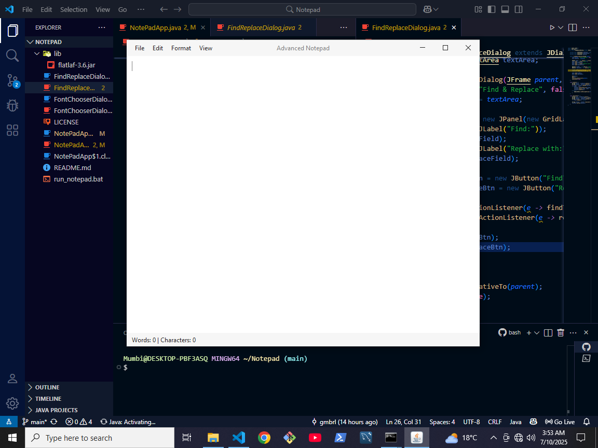
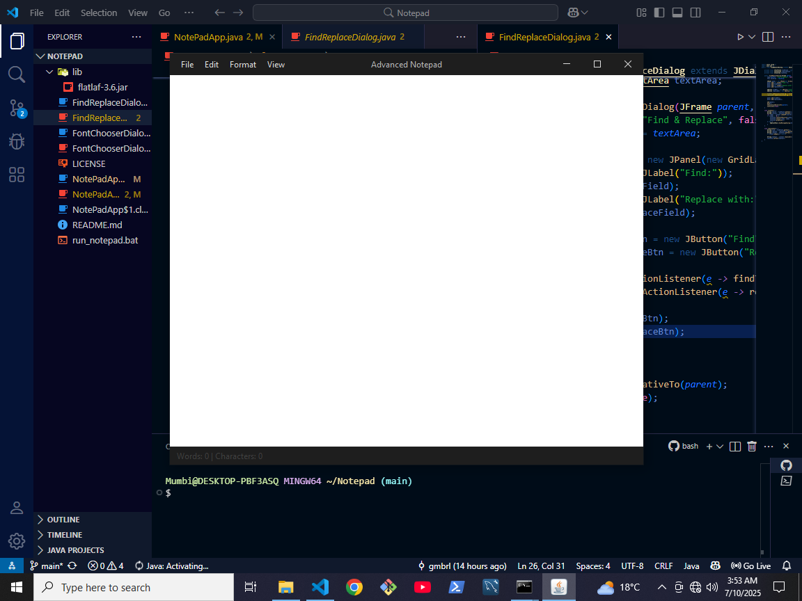
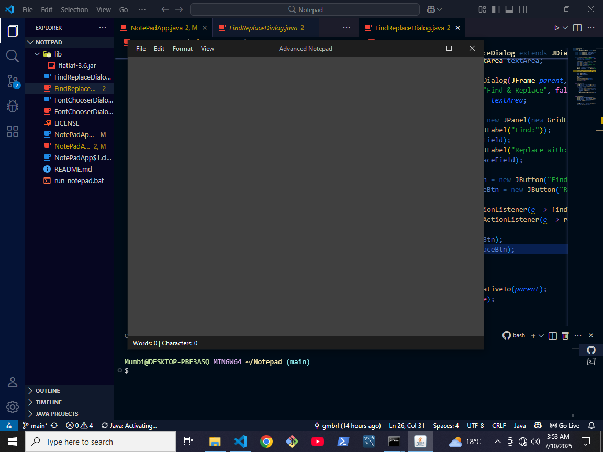
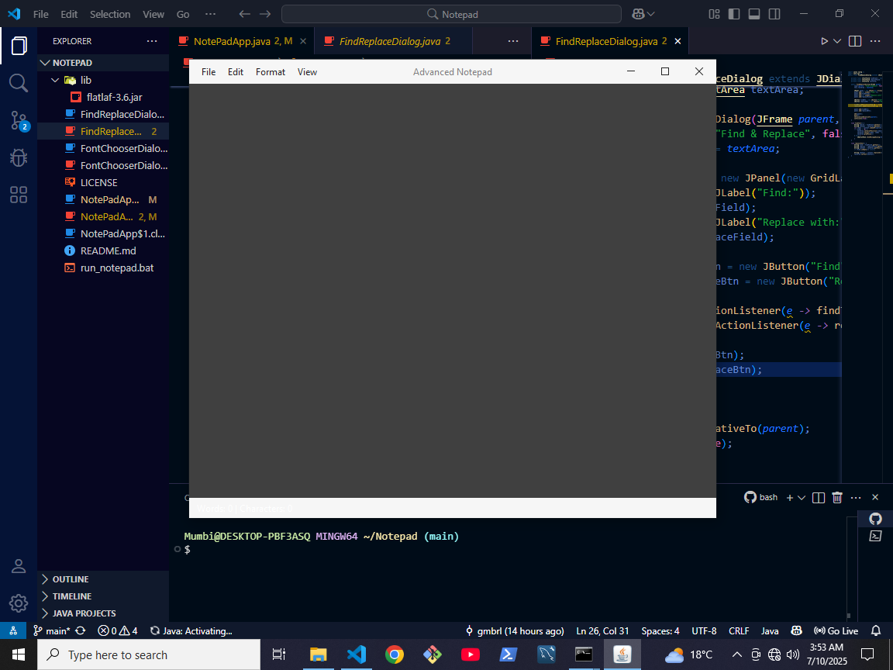

# Notepad Java App 📝

A lightweight, cross-platform Notepad clone built in Java Swing with a modern macOS-style interface using FlatLaf.

---

## ✨ Features

* ✅ Light/Dark Theme Toggle (FlatLaf based)
* 📝 Word & Character Count in Status Bar
* 🔍 Find & Replace Dialog
* 🎨 Font Picker Dialog
* 📁 Save, Open, New, Save As support
* 🖱️ Mac-style look and feel (FlatMacLight & FlatMacDark)

---

## imagespng





## 🚀 How to Run

### 📦 Prerequisites

* Java 17 or newer
* Download FlatLaf JAR ([https://search.maven.org/artifact/com.formdev/flatlaf](https://search.maven.org/artifact/com.formdev/flatlaf))

### 💻 Compile the Code

Open PowerShell or Command Prompt in the project folder:

```bash
javac -cp ".;lib/flatlaf-3.6.jar" NotePadApp.java FontChooserDialog.java FindReplaceDialog.java
```

### ▶️ Run the App

```bash
java --enable-native-access=ALL-UNNAMED -cp ".;lib/flatlaf-3.6.jar" NotePadApp
```

> On macOS/Linux, replace `;` with `:` in the classpath.

---

## 🔄 Using the Run Script

You can also run the app using the provided `run_notepad.bat` script:

```bash
./run_notepad.bat
```

This script:

* Compiles all `.java` files with FlatLaf
* Enables native access
* Launches the app automatically

Make sure `flatlaf-3.6.jar` is placed inside the `lib/` folder.

---

## 📂 Project Structure

```
Notepad/
├── lib/
│   └── flatlaf-3.6.jar
├── NotePadApp.java
├── FontChooserDialog.java
├── FindReplaceDialog.java
├── run_notepad.bat
└── README.md
```

---

## 🧠 Notes

* Uses FlatLaf Mac themes to simulate macOS appearance
* Requires `--enable-native-access=ALL-UNNAMED` for native FlatLaf support
* Works on Windows, macOS, Linux

---

## 📜 License

This project is released under the [MIT License](https://opensource.org/licenses/MIT).

---

## 👨‍💻 Author

Gmbrl – [chegepeterson12@gmail.com](mailto:chegepeterson12@gmail.com)
